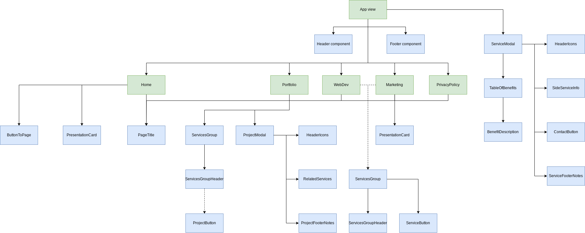
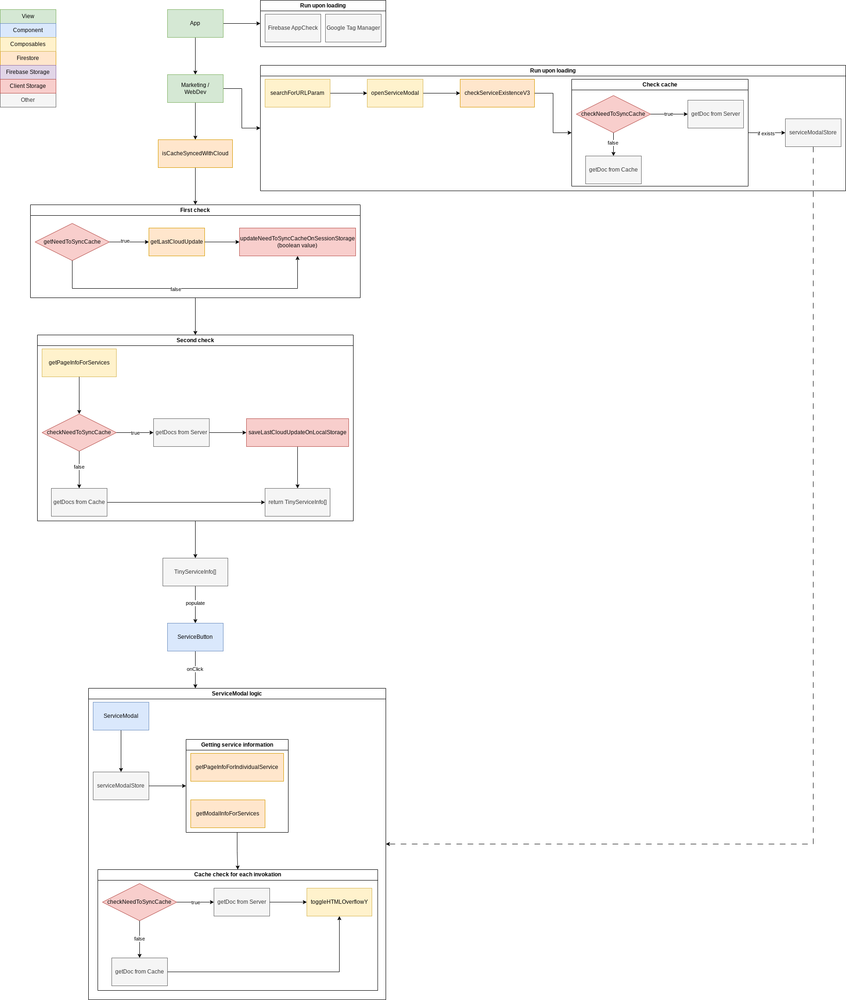
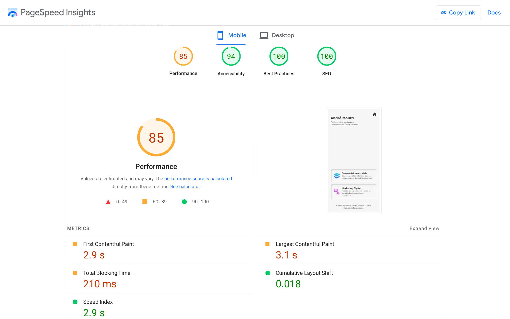
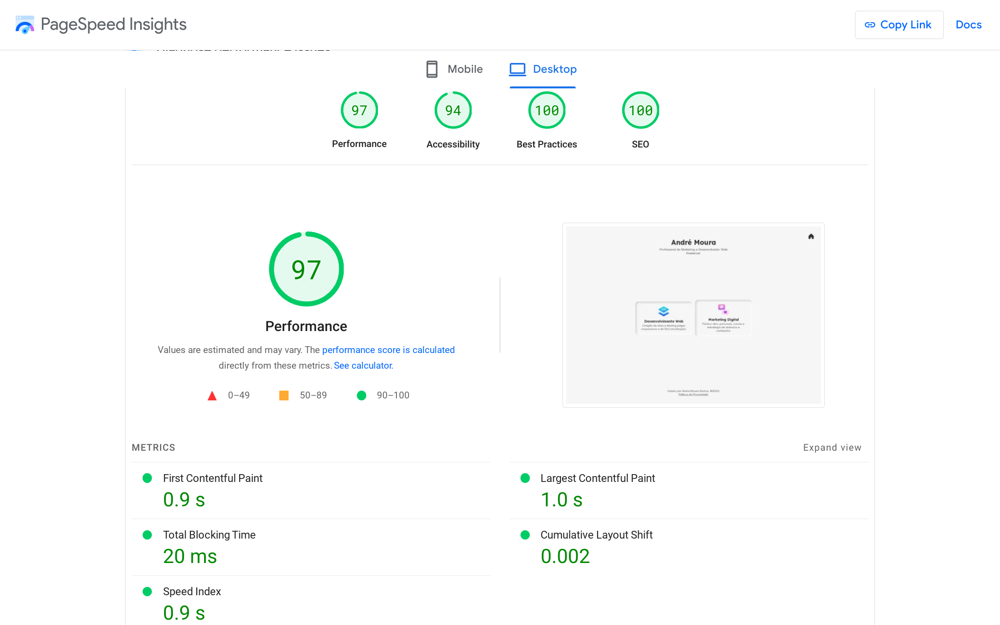

# Sobre o repositório

Esse repositório guarda os arquivos do novo site desenvolvi, que pode ser acessado [clicando aqui ↗](https://andremourasantos.com.br). Em sua mais recente repaginada, este site agora apresenta meus serviços de freelancer para [Desenvolvimento Web ↗](https://andremourasantos.com.br/desenvolvimento-web) e [Marketing Digital ↗](https://andremourasantos.com.br/marketing-digital).

> Com este site e seu novo visual, posso apresentá-lo como uma representação das minhas habilidades em web design e desenvolvimento web em ascensão.

## Tecnologias usadas

_*Atualizado em fevereiro de 2024._

  
  
  
  
  
  
  
  
  
  

---

## O que aprendi com este projeto?

- Aplicação do _neumorphism_ em designs, com atenção à acessibilidade.
- Criação de uma árvore de componentes do Vue para organizar o projeto.
- Criação de uma árvore de lógica para facilitar a criação e manutenção dos códigos dos componentes.
- Uso da biblioteca `vue-gtm`, de [gtm-support](https://github.com/gtm-support/vue-gtm), para configuração e acompanhamento de eventos personalizados na aplicação.
- Uso de Camadas de Dados (_Data Layers_) para transmitir dados de eventos a partir de interações com componentes.
- Uso de touch events para funcionalidades de "swipe" em carrosséis.
- Uso e configuração básica do TypeScript, bem como a criação de tipos globais e validação de dados.
- Controle de cache do Firestore para otimização de requisições ao servidor.

---

## Árvore de componentes e lógica

_*Atualizado em fevereiro de 2024._

Veja abaixo a árvore de componentes do VueJs e também o fluxograma de lógica da aplicação, assim, você poderá ter um bom entendimento de como o projeto foi estruturado desde o começo para permitir uma fácil manutenção e adição de funcionalidades.

### Árvore de componentes da aplicação

### Fluxograma das views Marketing e WebDev

### Fluxograma da view Portfolio

---

## Fotos do projeto

_*Atualizado em janeiro de 2024._

---

## Desempenho do site

_*Atualizado em outubro de 2023._

O desempenho do site pode ser visto a partir de testes do [PageSpeed Insights ↗](https://pagespeed.web.dev/analysis?url=https%3A%2F%2Fandremourasantos.com.br%2F).

