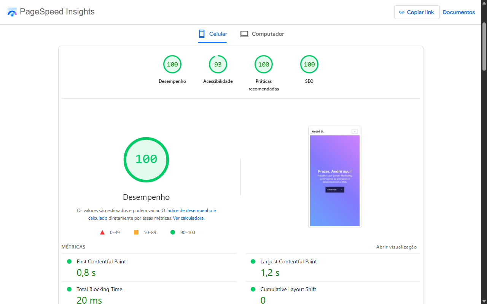

# Sobre o repositório

Este é o repositório do [meu site](https://andremourasantos.com.br/?utm_source=github&utm_medium=readme), por aqui você encontrará o todo código fonte do front-end do site.

Para os curiosos de plantão, alguns artigos em produção podem estar disponíveis aqui também 👀

> A mais recente versão do meu site (2025) visa atualizar a minha imagem profissional e apresentar meus projetos e trabalhos com uma óptica menos técnica e mais prática.

## Tecnologias usadas

_*Atualizado em fevereiro de 2024._

  
  
  
  
  
  
  

---

## O que aprendi com este projeto?

- Utilização de frontmatter para classificação de documentos Markdown (permitindo a criação de blogs e portfólios).
- Otimização técnica profunda para máximo desempenho no PageSpeed Insights.
- Inserção de container GTM sem prejuízo de desempenho.
- Otimização fina para melhoria do LCP.
- Integração de Webhooks para funcionalidades como assinatura de newsletter.
- Carregamento local de fontes para incremento da velocidade de carregamento.

---

## Fotos do projeto

_*Atualizado em junho de 2025._

---

## Desempenho do site

_*Atualizado em outubro de 2023._

O desempenho do site pode ser visto a partir de testes do [PageSpeed Insights ↗](https://pagespeed.web.dev/analysis/https-andremourasantos-com-br/fozqx4h0dd).

