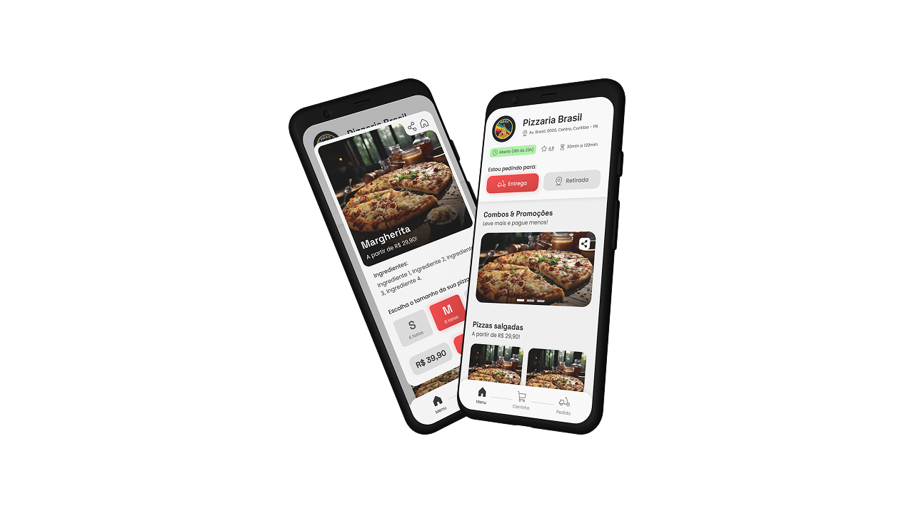

Estar no Ifood tornou-se mandatório para quem busca visibilidade e volume de pedidos no mercado de delivery.

Eu mesmo tenho o app instalado no meu telefone (RIP Uber Eats :c) e vez ou outra entro para dar uma olhada nas promoções.

No entanto, por trás da facilidade de uso e do acesso a uma vasta base de usuários "prontos" para comprar de você logo de cara, encontra-se um dilema que impacta diretamente a longevidade dos negócios: a dependência.

As comissões e taxas arbitrárias cobradas por essas plataformas, junto a alta competitividade do mercado, acabam por corroem as margens de lucro, forçando o seu negócio em uma economia de escala de forma prematura.

E, com isso, a sua operação acaba virando uma corrida para apenas fechar novos pedidos, sem a construção de uma base de clientes fiéis.

Só para no fim, você vender, entregar e o cliente nem lembrar do nome da sua empresa, afinal de contas, ele comprou "do Ifood", não da sua empresa.

Essa situação gera uma pergunta crucial para qualquer empreendedor do ramo: como crescer de forma sustentável e ter mais controle sobre o próprio destino em um mercado tão competitivo?

## Criando um canal de vendas próprio

Imagine ter um canal de vendas onde cada pedido representa 100% da receita (descontando apenas custos de operação e meios de pagamento, claro), sem a fatia significativa das plataformas.

Um lugar onde você conhece seu cliente, pode se comunicar diretamente com ele e incentivá-lo a voltar.

E eu não estou falando de campanhas genéricas no WhatsApp ou publicações nas redes sociais.

Eu estou falando de um canal de vendas próprio: como um site ou um aplicativo web progressivo (PWA).

### As vantagens de um canal de vendas próprio

Para entender melhor, pense em uma pizzaria local.

Em vez de depender exclusivamente dos pedidos que chegam via marketplace, essa pizzaria investe em um site próprio com funcionalidade PWA.

O custo incial pode até ser um pouco maior, mas ela está pensando a **longo prazo**.

Um PWA permite que o cliente "instale" o seu site no celular dele, funcionando de forma muito semelhante a um aplicativo, como o próprio Ifood, mas sem a necessidade de baixar pela loja de apps.

Isso proporciona uma experiência de usuário fluida, rápida e que ainda permite o envio de notificações push – um canal direto e poderoso de comunicação para promoções e novidades.

Com um PWA, você pode estar presente diretamente na tela inicial do telefone do seu cliente, **do lado** do app do Ifood, não mais dentro dele, criando um canal direto mais lucrativo para vendas.

## A economia de um canal de vendas próprio

A diferença mais significativa de ter um canal próprio é a economia com as taxas das plataformas.

Uma comissão que varia de 12% e 23% sobre o valor total dos pedidos, [como é o caso do Ifood](https://expressodelivery.com.br/calculadora-ifood/), representa uma fatia considerável do seu faturamento que deixa de ir para o caixa da empresa.

Além disso, você precisa pagar uma mensalidade totalmente arbitrária e diversas outras taxas referentes ao recebimento de pagamentos pela plataforma e prestação de serviços.

> E se eles inventarem uma nova taxa amanhã: como fica o seu negócio?

Ao eliminar ou reduzir drasticamente essas despesas, você aumenta a sua margem de lucro.

E com uma margem de lucro maior, mesmo vendo seus produtos pelo mesmo preço da concorrência, você ainda pode lucrar mais que eles.

### Reinvestimento em tráfego pago

Mas a economia com taxas e mensalidades não é o único benefício.

Esse dinheiro, antes perdido, agora pode ser reinvestido no próprio negócio.

E a forma mais eficaz de fazer isso é através do tráfego pago.

Com campanhas segmentadas no Google Ads ou nas redes sociais, por exemplo, você pode direcionar clientes em potencial diretamente para o seu site.

Isso, além de aumentar drasticamente o tamanho do público ao qual tem acesso, diversifica os seus canais de aquisição de clientes, tornado o seu negócio mais resiliente.

Assim, você pode não somente pensar em estratégias de **remarketing**, como também tem um maior controle sobre o **Custo por Aquisição de Cliente (CAC)**, uma vez que você está no controle da maioria das variáveis.

## Trabalhando com a fidelização de clientes

Com um canal de vendas próprio, você ainda recupera o controle sobre os dados dos seus clientes.

Nome, endereço, WhatsApp... — todas essas informações se tornam acessíveis (respeitando a LGPD, é claro).

E esse acesso direto permite que você vá muito além da simples entrega de um pedido:
* Você pode implementar programas de fidelidade;
* Enviar promoções hiper-personalizadas;
* Celebrar datas comemorativas com ofertas exclusivas;
* Enviar notificações push diretamente para seus clientes, ou ainda;
* Entrar em contato pelo WhatsApp para uma oferta imperdível.

Construir essa base de clientes fiéis não só aumenta o _Costumer Lifetime Value_ (Valor da Vida Útil do Cliente) mas também reduz a dependência de atrair novos consumidores constantemente, criando uma base sólida de **receita recorrente**.

## Abordagem híbrida para os canais de venda

Adotar um canal de vendas próprio não significa, necessariamente, abandonar as plataformas de delivery por completo.

Para muitos negócios, uma estratégia híbrida pode ser o caminho mais inteligente.

As plataformas podem continuar sendo uma fonte de novos clientes, funcionando como um funil adicional.

No entanto, o objetivo primário passa a ser direcionar a maior parte dos esforços e a comunicação para o canal próprio, incentivando os clientes a fazerem pedidos diretamente por ali nas próximas vezes.

Tranformando a loja no Ifood em uma **fonte adicional** de receita, e não *toda fonte de receita*.

Essa visão de longo prazo foca na construção de uma base de clientes e de um canal de vendas que pertencem ao negócio, garantindo maior autonomia, lucratividade e a capacidade de adaptação em um mercado em constante mudança.

É um passo essencial para quem busca não apenas sobreviver, mas prosperar no setor de delivery.

Quer discutir como uma solução própria pode liberar seu negócio da dependência e impulsionar seu crescimento? [Vamos conversar pelo WhatsApp](https://api.whatsapp.com/send/?phone=5541935009236&text=Oi%2C%20gostaria%20de%20entrar%20em%20contato%20para%20apresentar%20meu%20projeto), sem compromisso!