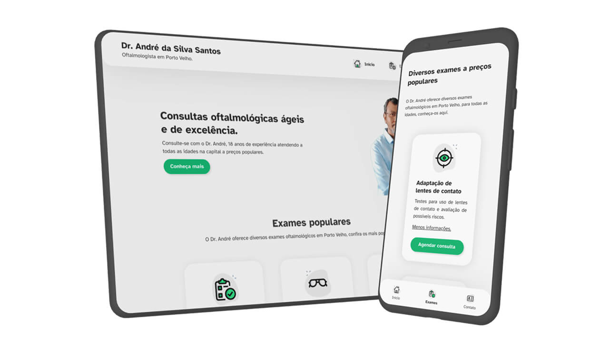

Todo projeto de web design começa com um desafio.

E quando esse desafio envolve a área da saúde, com suas particularidades e a necessidade crucial de comunicação clara e acessível, além de restrições para publicidade, impostas pelo Conselho Federal de Medicina (CFM), a complexidade aumenta.

Meu ponto de partida para este, que seria meu primeiro cliente, foi a necessidade do Dr. André, um oftalmologista renomado, atuando há mais de 18 anos em Rondônia, de conseguir mais pacientes particulares.

À época, o Doutor buscava um site que refletisse a qualidade de seu atendimento e facilitasse o agendamento por potenciais novos pacientes, especialmente considerando que ele ofertava diferentes serviços em múltiplas clínicas.

O cenário inicial era o de escassa presença digital, salvo sites como Doctoralia e uma entrada no Google Maps.

Essa foi a oportunidade perfeita para ir além do convencional, introduzindo conceitos modernos de web design, aprimorando a acessibilidade e otimizando a performance para diversos dispositivos e condições de acesso à internet.

## Antes de mais nada, quais eram as necessidades dos pacientes?

Antes de pensar em cores, tipografia, layouts ou linhas de código, mergulhamos no universo dos pacientes do Dr. André.

Afinal, um site médico não é apenas um cartão de visitas online para o profissional; é, acima de tudo, uma ferramenta de informação e conexão para quem busca cuidado para a saúde dos olhos.
* Quais são as principais informações que eles procuram ao acessar um site de um oftalmologista?
* Onde encontrar os endereços das clínicas?
* Quais exames são oferecidos?
* Como agendar uma consulta de forma rápida e descomplicada?

Essa fase de "discovery" foi fundamental.

A principal dor identificada era a dificuldade em localizar informações essenciais, como exames disponíveis, horários de atendimento e formas de contato atualizadas.

Mas ele precisava de um site que, além de informativo, permitisse que os agendamentos fossem feitos diretamente pelo WhatsApp de cada consultório de forma rápida.

A mediação entre as necessidades do público (pacientes buscando informação clara e acessível) e as exigências do cliente (o Dr. que desejava expor seus serviços para o maior número de pessoas possível) tornou-se o cerne do projeto.

## Definindo conteúdo antes de visuais

Compreendidas as dores e expectativas de ambos os lados, o próximo passo foi definir a arquitetura da informação do novo site.

Como organizar os serviços e as localizações das clínicas de forma que qualquer paciente pudesse encontrar o que precisava rapidamente?

A solução envolveu a criação de uma estrutura lógica e intuitiva:
* Cada clínica ganhou seu espaço de destaque, com informações claras de endereço e informações de contato;
* Os exames e procedimentos foram categorizados e descritos de forma acessível, focando no que os pacientes podem buscar no Google;
* A opção de contato direto via WhatsApp para agendamentos particulares foi posicionada em locais estratégicos, facilitando a conversão.

Cada clique, cada seção, foi desenhada para guiar o usuário sem atritos, proporcionando uma experiência tranquila em um momento que, para muitos, pode envolver alguma apreensão, já que muitos dos pacientes do Doutor eram mais idosos ou pais de crianças pequenas.

## Usabilidade e a identidade visual do Dr. André

O design de um site médico vai muito além da estética: ele precisa transmitir segurança, ser calmante e, acima de tudo, funcional.

A identidade visual do Dr. André foi projetada para ser simples e elegante, utilizando cores e elementos visuais que transmitissem confiança e acolhimento:
* Grandes espaços negativos para focar a atenção e dar "espaço" para os usuários;
* Uma combinação de branco e verde similar a de outras plataformas online que o usuário já deve ter usado, como o Doctoralia.
* A tipografia, com uso da Atkinson Hyperlegible, foi pensada para máxima legibilidade para pessoas com impeditivos visuais (grande parte dos potenciais clientes do Doutor).

A usabilidade foi uma prioridade inegociável.

Implementei o conceito "mobile-first", recomendada pelo Google para melhor indexação e garantindo que a experiência no celular fosse tão boa, ou até melhor, do que no computador.

Esse detalhe foi crucial para o site do Doutor, já que mais de 70% dos seus acessos viam de dispositivos móveis.

A performance também foi um fator-chave.

Um site lento é um obstáculo tanto para indexação no Google quanto para quem busca informações nele, além de repassar a sensação de obsoleto, desatualizado e até mesmo não confiável.

As imagens foram otimizadas, os códigos do site minimizados e utilizei as tecnologias mais modernas para garantir que o site carregasse rapidamente, mesmo em conexões de internet mais lentas, como carregamento dinâmico de imagens WEBP.

## Acessibilidade digital

A acessibilidade não é apenas uma boa prática: é uma necessidade ética.

Pessoas com deficiências visuais, o foco deste projeto, devem ter o mesmo acesso à informação e aos serviços que qualquer outro usuário. No caso do site do Dr. André, essa preocupação foi elevada a um patamar central no projeto.

E, para tal, implementei diversas funcionalidades para garantir a acessibilidade de uso do site, como:
* Texto alternativo em imagens para leitores de tela;
* Contraste de cores adequado;
* Navegação por teclado;
* Redimensionamento de fontes acima da média (para facilitar a leitura);
* Baixa quantidade de animações;
* Entre outras.

![A imagem exibe elementos de design focados em acessibilidade visual. À esquerda, amostras de cores verde e preta com códigos hexadecimais e exemplos da letra Aa demonstram considerações de contraste. À direita, a tipografia Atkinson Hyperlegible é destacada, com informações sobre suporte a idiomas e estilos, além de exemplos visuais da fonte em diferentes apresentações de nitidez. A imagem como um todo sugere uma ênfase na legibilidade e no contraste de cores para garantir a acessibilidade do conteúdo textual.](../../assets/photos/posts/site-para-oftalmologista_identidade-visual.png)

Cada detalhe foi pensado para remover barreiras e garantir que qualquer paciente pudesse encontrar as informações de que precisava, independentemente de suas condições.

A saúde visual é uma área onde a acessibilidade digital se torna ainda mais relevante, e incorporar essas práticas foi um compromisso com a inclusão e o cuidado para com o público do Doutor.

## Resultados e o impacto na presença digital

Com o novo site no ar, o impacto na presença digital do Dr. André foi notável, tanto na pesquisa do Google como nas conversões pelo WhatsApp.

Os pacientes passaram a encontrar as informações essenciais com muito mais facilidade, o que se refletiu em um aumento nos contatos e agendamentos de consultas particulares.

A estrutura flexível, construída com o uso de um Banco de Dados, permitiu que as atualizações sobre serviços e locais de atendimento fossem feitas de forma rápida e descomplicada, até mesmo pelo telefone, adaptando-se às necessidades do Doutor.

Além disso, a implementação de um relatório automatizado forneceu ao Dr. André insights valiosos sobre o comportamento de seus pacientes no site, como:
* Como os pacientes o encontraram na pesquisa do Google?
* Quais serviços são mais buscados?
* Quais consultórios geram mais interesse?
* Quais as tendências sazonais do seu público?

Essas informações, baseadas em dados, auxiliam na tomada de decisões estratégicas, tanto para o atendimento quanto para futuras campanhas de mídia paga.

O site se tornou não apenas um ponto de contato, mas uma ferramenta inteligente para entender e servir melhor os pacientes.

A abordagem estratégica, centrada no usuário e nos objetivos do cliente, demonstrou o que é possível alcançar com um site bem otimizado para profissionais da saúde, além de se libertarem de serviços como Doctoralia e similares, que cobram assinaturas caríssimas.

## O que tirar desse projeto?

Este projeto reforçou a importância de uma abordagem centrada nas pessoas — tanto o cliente quanto o público final — no processo de web design.

Não se trata apenas de construir um site bonito ou tecnologicamente avançado, mas de criar uma solução digital que resolva problemas reais, facilite a vida das pessoas e contribua para os objetivos do negócio de forma substancial.

A parceria de longo prazo com o Dr. André, que começou em 2021 e já dura mais de 2 anos, demonstra o valor de um relacionamento baseado na confiança e na melhoria contínua.

O site não é um projeto estático: ele evolui conforme as necessidades do Dr. André e de seus pacientes mudam e novas melhorias continuam a ser implementadas, garantindo que a presença digital do Dr. André permaneça relevante.

Desenvolver sites para nichos específicos, como a área da saúde, exige sensibilidade, atenção aos detalhes e um profundo entendimento das particularidades desse universo.

É um desafio recompensador que me permitiu aplicar habilidades técnicas da faculdade a problemas reais e fazer a diferença na vida das pessoas.