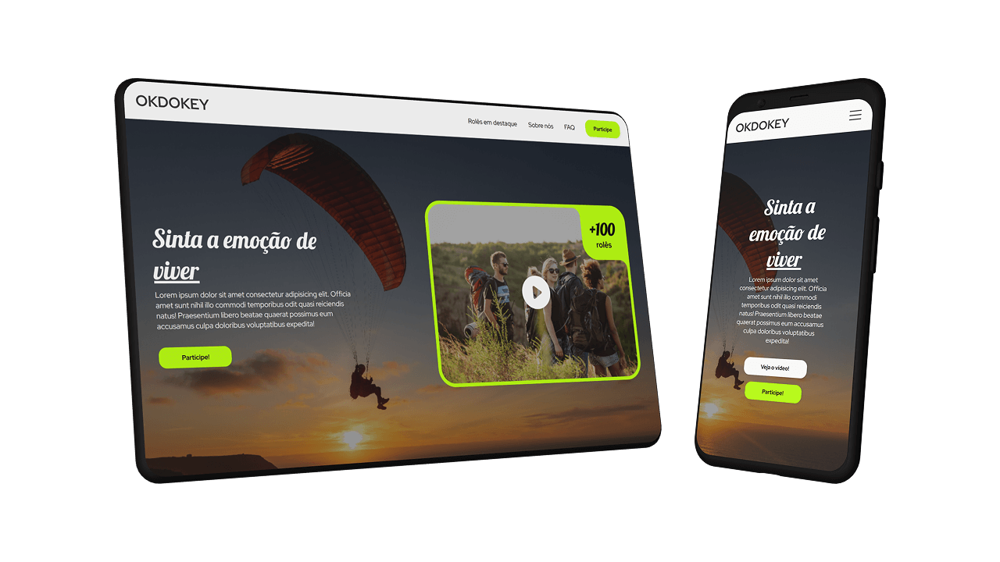

O mercado de turismo está em constante movimento, e agora, com a queda das restrições da pandemia, de volta em alta.

Para as agências de viagem e turismo, ter uma forte presença online não é mais um diferencial: é a forma de ser vista, lembrada e de aparecer em pesquisas por potenciais clientes.

Potenciais clientes esses que buscam informações, inspiração e confiança antes de tomar a decisão de sequer entrar em contato com você.

Pude experienciar esses problemas na pele, enquanto buscava informações sobre uma agência para uma viagem de salto de paraquedas.

Porém, tudo que pude encontrar foi um site sem informações relevantes e um Instagram com alguns vídeos de prova social.

No fim, acabei fechando negócio com eles — relutantemente —, mas somente graças a uma **forte indicação** de um amigo de confiança. Se não por ele, jamais teria sequer considerado passar meu cartão de crédito.

Como, então, criar um espaço digital que não apenas informe, mas que cative, construa confiança e, o mais importante, converta visitantes em clientes fiéis?

## OKDOKEY: uma demonstração de potencial

Pensando nesse desafio, desenvolvi uma demonstração de site para uma agência de viagens fictícia, a OKDOKEY.

O objetivo foi ir além do básico e criar uma plataforma que tivesse uma **personalidade forte** e fosse estrategicamente pensada para o setor.

Imagine um site que, ao ser acessado, já transmite a energia, a confiabilidade e a emoção que só uma grande viagem pode oferecer: essa é a essência da OKDOKEY!

Desde o primeiro olhar, a intenção foi prender a atenção.

A **Hero Section** foi desenhada para ser imediatamente chamativa, utilizando imagens vibrantes e mensagens claras que convidam o visitante a explorar.

Todo site foi pensado em uma agência que ofertava *rolês* de salto de paraquedas, já que me senti bem inspirado depois dessa experiência (*recomendo a todos!*).

## Como construir confiança e despertar desejo?

Em um mercado onde a confiança é crucial, apresentar **provas sociais** diversas é um pilar estratégico.

E aqui, tanto um site quanto as redes sociais podem fazer um excelente trabalho.

Nesse exemplo, o site da OKDOKEY deixa abertura para um vídeo promocional logo na primeira dobra, o que permite que a agência mostre a alma do seu serviço, além de expor depoimentos de clientes e histórias cativantes para o público.

Pode ser um compilado de destinos incríveis, o depoimento em vídeo de um cliente emocionado, ou um vídeo institucional que apresenta a equipe por trás das viagens: o vídeo tem um poder único de engajamento e de criar uma conexão emocional instantânea com o visitante.

## Porquê um site e não apenas uma rede social?

Assim como as redes sociais são apenas uma parte do negócio, e não o negócio em si: um site é uma engrenagem da equação.

Para que uma agência de viagens prospere online, ela precisa de inteligência por trás da operação, e a demonstração da OKDOKEY inclui a possibilidade de integração com ferramentas poderosas de captura e análise de dados, como **Google Analytics** e **Pixel da Meta**.

![Diagrama ilustrando o fluxo de informações de diversas plataformas online para um site de agência de viagens chamado 'OKDOKEY' e, posteriormente, para canais de interação com o usuário. À esquerda, um agrupamento de logos de plataformas de anúncios e redes sociais (Google Ads, WhatsApp, TikTok, Facebook, Instagram, Google, Bing, Meta) está conectado ao centro da imagem, onde um smartphone exibe a site da agência de viagens OKDOKEY. À direita do smartphone, este está conectado a um nó central com o avatar de uma pessoa (representando um cliente), que por sua vez se conecta a ícones de localização (mapa), chat (conversação) e telefone (chamada), refletindo as informações que são possíveis de coletar do usuário.](../../assets/photos/posts/okdokey-agencia-de-viagens_coleta-de-informacoes.png)

Isso permite que a agência entenda o comportamento dos seus visitantes, descubra de onde eles vêm, quais páginas visitam e quais ações realizam.

Esses dados são ouro para otimizar campanhas de marketing e anúncios, garantindo que o investimento esteja gerando o melhor retorno possível.

### Maximização do retorno com tráfego pago

Imagine que você investe pesado em anúncios no Instagram para promover a próxima viagem que a sua agência está planejando e atrair potenciais clientes.

Mas e se esse potencial cliente também passa horas no TikTok procurando inspiração para viagens iguaiszinhas a que a sua agência está planejando?

Ou ainda se ele prefere usar o Google para pesquisar destinos e comparar os preços de diferntes agências?

Ao depender apenas de uma plataforma, você fica "preso" a ela, limitando seu alcance a quem está ativo ali e deixando de lado esses outros canais onde seu público pode estar.

Com um site próprio, a situação muda radicalmente: ele se torna seu *hub* digital.

Independentemente de onde um visitante venha (seja do Instagram, TikTok, Google, ou a partir de um link do WhatsApp), você pode rastrear essa visita: e isso abre um leque enorme de possibilidades de remarketing.

![Diagrama com um smartphone central exibindo o site da agência de viagens 'OKDOKEY'. O smartphone atua como um hub, conectando-se a logos de diversas plataformas de mídia social e publicidade à esquerda (WhatsApp, TikTok, Instagram e Facebook) e à direita (Google Ads, Meta Ads, Pesquisa do Google e Pesquisa do Bing). As linhas conectando o smartphone a essas plataformas ilustram como um site próprio pode centralizar o tráfego proveniente de diferentes canais online, permitindo o rastreamento de visitantes independentemente de sua origem.](../../assets/photos/posts/okdokey-agencia-de-viagens_hub.png)

Você pode, por exemplo, mostrar um anúncio no TikTok para alguém que visitou a página de pacotes no seu site, mesmo que ele tenha chegado lá pelo Google e não te siga no Instagram.

E essa capacidade de "seguir" o potencial cliente por diversas plataformas significa que sua agência pode aparecer em múltiplos pontos de contato durante a jornada de decisão dele, aumentando significativamente suas chances de conversão.

É uma estratégia muito mais robusta e abrangente para aquisição de tráfego pago, resultando em um melhor [retorno sobre o seu investimento em anúncio (ROAS)](/trabalhos/obtendo-o-roas-de-campanhas-publicitarias).

### Valorização financeira do relacionamento com cliente

A automação de marketing, exemplificada pela possibilidade de integração com ferramentas como RD Station, Bitrix24, Pipedrive ou similares, é outro componente vital.

![Diagrama que ilustra um fluxo de captação e conversão de leads para uma agência de viagens online chamada OKDOKEY, exibida em um smartphone à esquerda. O smartphone mostra um formulário de inscrição para uma newsletter. Uma linha conecta o formulário a um ícone de pessoa (representando um lead), que por sua vez se conecta a um ícone de e-mail (comunicação). O e-mail está ligado a um ícone de um vendedor, que então se conecta a um nó central com um avião decolando (representando ofertas de viagens), uma mão com moedas (representando formas de pagamento) e um cupom de desconto (representando promoções). Desse nó central, partem conexões para um ícone de aperto de mãos (representando o fechamento de negócio).](../../assets/photos/posts/okdokey-agencia-de-viagens_crm.png)

Ao capturar leads através de formulários ou inscrições na newsletter, você pode nutrir esses contatos com informações relevantes, ofertas personalizadas e até registrar a jornada desse cliente no CRM.

Isso evita com que um potencial cliente seja descartado naquela momento apenas por não estar no momento de compra.

Fazendo com que sua agência tenha um melhor aproveitamento das pessoas que já demonstraram algum interesse pelas suas ofertas.

O que também facilita com que você faça novas ofertas para clientes já existentes, aumentando ainda o *Costumer Lifetime Value* (Valor da Vida Útil do Cliente) do seu negócio, tornando-o mais sustentável a longo prazo.

### Atualizações dinâmicas via Banco de Dados

E para manter todo o conteúdo, especialmente os pacotes de viagem (ou "rolês", como na demonstração), sempre atualizados? A resposta está na flexibilidade de um Banco de Dados.

Conectar o site a um banco de dados significa que as informações sobre destinos, preços, datas e detalhes dos pacotes podem ser atualizadas de forma rápida e centralizada, a partir de qualquer dispositivo com acesso.

![Diagrama ilustrando o processo de atualização de conteúdo de um site de viagens conectado a um banco de dados. À esquerda, um smartphone rotulado como Antes exibe a tela de um pacote de Salto de paraquedas. Uma linha conecta este smartphone a um fluxo central que passa por um ícone de pessoa rotulado como Pessoa autorizada, seguido por um ícone de servidores rotulado como Atualização no servidor e, finalmente, um ícone de globo terrestre rotulado como Site. Do ícone do site, uma linha se conecta a um smartphone à direita, rotulado como Depois, que exibe, ao invés de um pacto de Salto de paraquedas, agora exibe um pacote de Bungee jumping. O diagrama visualiza como uma pessoa autorizada pode atualizar informações no banco de dados, refletindo-se na mudança de conteúdo exibido no site.](../../assets/photos/posts/okdokey-agencia-de-viagens_banco-de-dados.png)

Isso elimina a necessidade de mexer no código do site ou ter de fazer uma postagem nas redes a cada pequena mudança.

O que garante que os seus clientes sempre vejam as informações mais atualizadas, evitando até complicações legais do Código de Defesa do Consumidor (CDC).

## Uma experiência completa para o cliente

A demonstração do site OKDOKEY representa um **pacote simples, prático e funcional** que visa impulsionar o negócio de agências de viagens.

Ele transmite **legitimidade e profissionalismo**, elementos cruciais na hora de convencer potenciais clientes que nunca ouviram falar do seu negócio.

Ao oferecer uma experiência de navegação fluida e rica em informações relevantes, a agência melhora a **experiência do potencial cliente** desde o primeiro contato digital.

Um site com essa estrutura não é apenas uma vitrine: é uma ferramenta de crescimento estratégico.

Ele educa, esclarece dúvidas, constrói autoridade e, através das integrações e funcionalidades de captação, se torna um motor para a **geração de leads** qualificados.

## Transforme sua agência com um site moderno e eficaz

Em um mundo onde a próxima viagem começa com uma busca online, ter uma presença digital que se destaque é fundamental.

A demonstração OKDOKEY ilustra o poder de um site responsivo, estrategicamente pensado e equipado com as ferramentas certas para converter visitantes em viajantes.

Se você é dono ou gestor de uma agência de viagens buscando modernizar sua operação online, ou um profissional de marketing no setor de turismo em busca de soluções eficazes, este é o tipo de plataforma que pode fazer a diferença.

[Fale comigo](https://api.whatsapp.com/send/?phone=5541935009236&text=Oi%2C%20gostaria%20de%20entrar%20em%20contato%20para%20apresentar%20meu%20projeto) e saiba como ter um site que não apenas representa sua agência, mas que gere leads para o seu negócio!

> Você também pode visitar a demonstração do site através [deste link](https://andremourasantos.github.io/okdokey-agencia-de-viagens/)*.

> **O site de demonstração não coleta suas informações e não conta com ferramentas de análise de dados, para sua privacidade.*