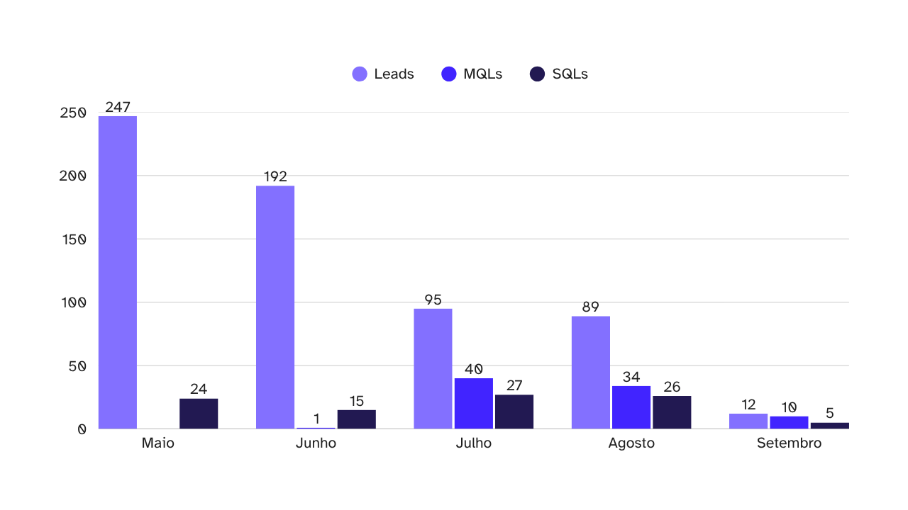
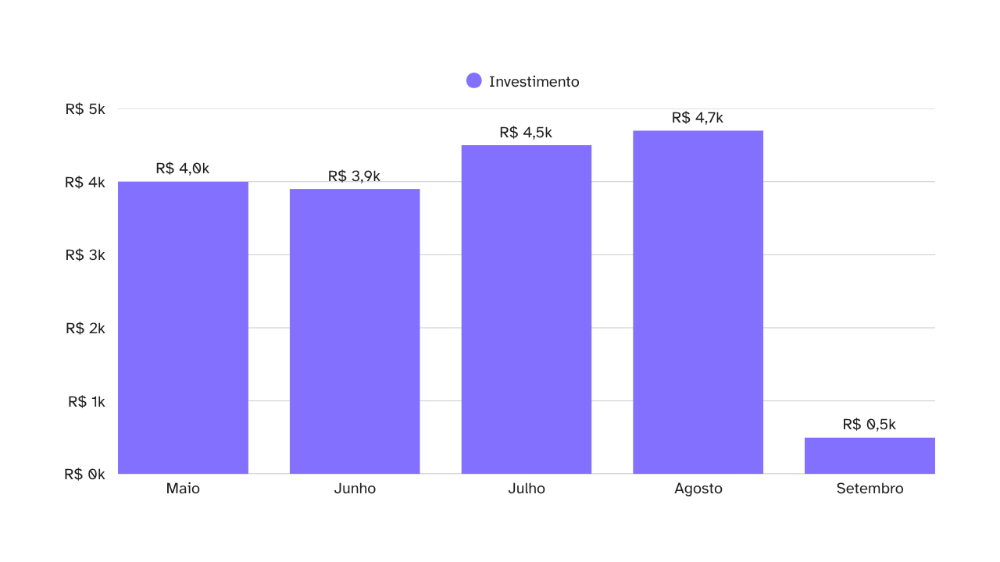
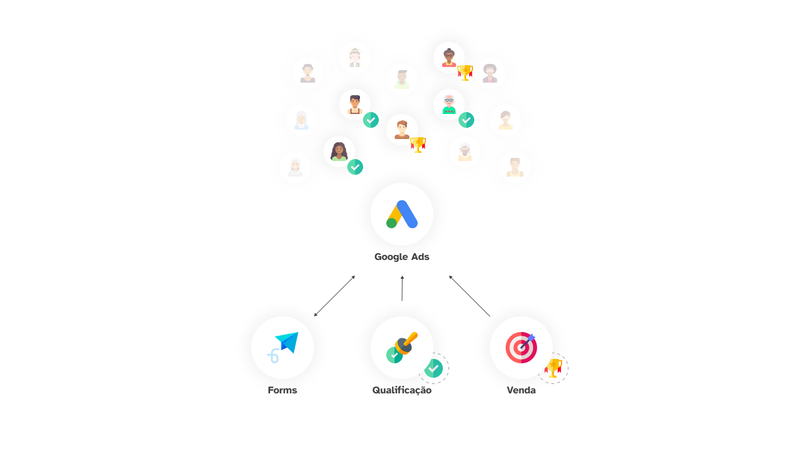
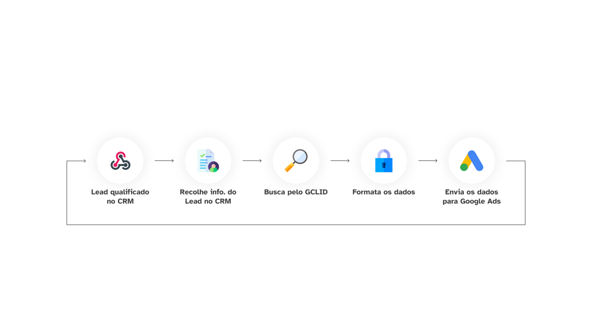

A otimização de campanhas de anúncios é um desafio constante para empresas que buscam maximizar seu retorno sobre o investimento (ROAS).

As agências de marketing ou prestadores de serviço por muitas vezes se baseiam apenas em conversões online (como conversões em forms ou conversas iniciadas no WhatsApp), perdendo de vista o que acontece após o lead entrar no funil de vendas.

Contudo, com o avanço da inteligência artificial nas plataformas de anúncios, a qualidade dos dados (e o que eles representam) é cada vez mais importante.

Para o melhor desempenho, não basta apenas medir as conversões em um formulário e o CPL, é preciso focar na aquisição de leads qualificados e no Custo de Aquisição de Clientes (CAC).

Este artigo explora como a integração de dados de conversões offline, diretamente do CRM, revolucionou a inteligência das campanhas na Engel Advogados, permitindo uma otimização mais precisa e alcançando um ROAS de 297% nas campanhas do Google Ads.

## O que é uma "conversão offline"?

As conversões offline são eventos importantes que ocorrem fora do meio onde a pessoa fez a conversão inicial (por assim dizer).

Por exemplo: se o seu Lead chegou no CRM através de um formulário em uma LP, essa conversão no formulário é o que está marcado como conversão no gerenciador de anúncios, certo?

Mas, depois do Lead cair no seu CRM, ele **ainda deve passar pelo processo de qualificação**, para então definir se vale seguir com ele ou não.

E é aqui que entra a conversão offline: com um processo de qualificação bem definido, é possível registrar um evento de conversão novo, como "Lead qualificado", e usar ele para guiar as suas campanhas.

Perceba como agora, ao invés de usar apenas as conversões no forms, as campanhas podem utilizar informação bem mais no fundo do funil para realizar as otimizações: dessa forma, você passa a otimizar os anúncios de acordo com o seu funil de vendas de forma automática!

Como mostra o diagrama, você não precisa parar em *"Lead qualificado"*: também é possível enviar conversões de *"Compra"* (com o valor da conversão) e, com isso, [obter o ROAS das campanhas](/trabalhos/obtendo-o-roas-de-campanhas-publicitarias) diretamente no painel gerenciador de anúncios.

> O próprio Mark Zuckerberg, inclusive, já comentou que, em breve, [a IA vai fazer toda gestão da campanha por conta própria (*reportagem em inglês*)](https://www.theverge.com/meta/659506/mark-zuckerberg-ai-facebook-ads) no Meta Ads, e você precisará apenas enviar o criativo e os eventos de conversão.

Todas essas informações adicionais ajudam a inteligência da campanha a identificar melhor quem é o seu "Lead qualificado" sem você precisar definir isso explicitamente nas configurações de público.

> Algumas configurações como Advantage+, do Meta, ou as campanhas de Performance MAX, do Google, só vão funcionar corretamente com esse nível de detalhe dos dados, caso contrário, vão queimar seu orçamento atirando para todos os lados em busca de "pessoas que preenchem formulários de contato".

## Qual o papel do CRM na inteligência das campanhas?

O CRM possui um papel fundamental na inteligência das campanhas, mas somente se utilizado corretamente.

O que eu quero dizer é que, caso você não tenha um CRM bem padronizado, um processo de qualificação bem definido e um gestor de tráfego pago que entende como funciona o seu funil de vendas, você não colherá os benefícios das conversões offline.

Isso porque, mesmo sendo essencial para a inteligência das campanhas, poucas são as empresas que possuem um CRM bem trabalhado; e menor ainda é o número de agências que se aproveitam disso.

Mas se você se questiona "qual é esse papel?", saiba que eu estou me referindo à função de **rastrear os leads e categorizá-los em etapas** (Kanban).

Essa função básica é o que torna toda a mágica possível.

Veja: o Google Ads — e qualquer outra plataforma de anúncios, na realidade — **é cego para os dados do seu CRM**, a única coisa que ele sabe são as conversões que os Leads fizeram na sua LP (como preencher o formulário, por exemplo).

E, a partir dessa informação (quem preencheu o formulário), a plataforma tenta identificar grupos de pessoas similares, com objetivo de mostrar o seu anúncio para elas e, então, fazê-las converter na sua página.

A verdade é que o gerenciador (quando não conectado ao seu CRM) **não mostra a eficácia da sua campanha**, **mas sim o quão eficiente são os seus anúncios** — quantos leads você consegue gerar com X orçamento (e nem estamos falando de Leads qualificados, apenas Leads mesmo). *E essas são duas coisas bem diferentes.*

Agora, com o poder de **rastrear os leads e categorizá-los em etapas** do CRM, o gerenciador tem acesso a uma informação bem mais importante do que *"quem converteu no formulário?"*: quem efetivamente virou cliente.

Afinal, caso seu negócio não seja um e-commerce, é certo que o resto da conversa com seu cliente (da qual o Google não tem acesso) vai acontecer no WhatsApp, portanto, o CRM atua aqui como um *middle-man*.

Ele organiza as conversões tanto para o time comercial entender quais leads estão mais quentes, quanto pode enviar os dados desse Lead de volta para o Google Ads, para que as campanhas também entendam quais são os melhores leads.

Munido então dessas informações, o algoritmo passa a otimizar suas campanhas para um grupo diferente de pessoas, as que efetivamente viraram clientes (ou as que se tornaram leads qualificados).

Com isso em mãos, o algoritmo terá um direcionamento muito mais rico para poder selecionar *quando*, *onde* e *para quem* os seus anúncios serão exibidos, aumentando exponencialmente a qualidade dos Leads.

> Esse é um ciclo de retroalimentação: quanto mais dados de clientes você retornar ao gerenciador, melhor o algoritmo fica em gerar novos clientes, o que garante que mais dados de clientes sejam retornados e assim por diante.

## Quais os resultados para as campanhas de anúncios?

Para exemplificar melhor os benefícios da configuração das conversões offline no Google Ads, resolvi trazer um pouco do meu trabalho na Engel Advogados.

A Engel, que [já apresentei em outro artigo](/trabalhos/como-alcancei-um-roas-de-320-em-um-escritorio-de-advocacia), é um escritório de advocacia que atua principalmente com teses de nicho, ou seja, trabalham com uma fatia muito específica do mercado (com um problema jurídico muito específico mesmo).

E como você já deve imaginar, com uma fatia tão pequena do todo, grande parte do foco nos trabalhos era na definição do público e formas de veiculação dos anúncios: *"Onde deve aparecer?"*, *"Para quem deve aparecer?"* e *"Quando deve aparecer?"*.

Mas se você já trabalhou com Google Ads, sabe que ele não gosta de fatias muito pequenas do público, e isso se traduziu em um *Custo por Lead* (CPL) altíssimo para o escritório: cada Lead chegava a custar R$ 100 para esse nicho em específico.

No entanto, a Engel tinha **duas vantagens** que a antiga agência que cuidava dos anúncios não conseguiu explorar em todo seu potencial:
1. Um CRM muito bem configurado, e;
1. Um processo comercial claro e bem segmentado.

E com esses dois blocos de base, foi possível configurar as marcações de Leads qualificados no CRM da Engel e, posteriormente, configurar uma nova — e temida — campanha de Performance Max no Google Ads.

Quanto às campanhas anteriores, elas foram encerradas, em prol da nova (e única) campanha, e todo o orçamento anterior foi redirecionado para essa iniciativa.

> Essa é uma estratégia que vêm ganhando força no mundo do tráfego pago: focar os esforços em poucas campanhas, mas com um orçamento muito maior. Até porque, como você verá em breve, quanto melhores os Leads, mais caro o CPL.

Em apenas dois meses, já foi possível ver os resultados:
* Entre Maio e Agosto, o número de Leads gerados diminuiu em ~64%;
* A proporção de Leads qualificados (MQLs) chegou a 42%, e;
* A proporção de SQLs disparou de ~10%, em Maio, para 30%, em Agosto, chegando a 41% no começo de Setembro (4x mais alta).

![O gráfico de barras verticais apresenta a evolução da captação mensal de Leads, MQLs (Marketing Qualified Leads) e SQLs (Sales Qualified Leads) no período de Maio a Setembro. Em Maio, foram gerados 247 Leads com 24 SQLs e 0 MQLs. Em Junho, os números foram 192 Leads, 15 SQLs e 1 MQL. Uma mudança drástica na proporção de leads qualificados é evidente a partir de Julho, quando foram registrados 95 Leads, 27 SQLs e 40 MQLs. Em Agosto, o volume de Leads se manteve baixo em 89, mas as qualificações foram altas, com 26 SQLs e 34 MQLs. Por fim, Setembro registrou 12 Leads, 5 SQLs e 10 MQLs. O gráfico demonstra claramente que, apesar da redução no volume total de Leads ao longo dos meses (caindo de 247 para 12), a proporção de MQLs e SQLs aumentou significativamente a partir de Julho, indicando uma otimização bem-sucedida na qualidade dos leads captados.](../../assets/photos/posts/alcancando-um-roas-de-297-com-conversoes-offline-4.png)

> Veja que, mesmo com a informação da qualificação disponível todo esse tempo, eles ainda não marcavam os Leads como qualificados no CRM, apenas se eram SQLs ou não. Essa informação começou a ser marcada apenas em Julho. Os dados de Setembro são de 01/09 a 04/09.

Com o sucesso preliminar da nova campanha, o orçamento foi gradualmente sendo elevado ao longo do tempo:

> Os dados de Setembro são de 01/09 a 04/09.

Agora, para os mais atentos: você deve pensar que o CPL aumentou nesse período, já que estamos investindo mais para receber menos Leads: e você está certo!

O CPL, que estava por volta de R$ 16 em Maio, chegou a bater os R$ 52 em Agosto.

Essa é uma das consequências de afunilar o público, que, nesse caso, foi uma ação executada automaticamente pela inteligência de campanha do Google, aprimorada pelos dados de conversão offline do CRM da Engel Advogados.

No entanto, quando comparamos o custo por SQL (que é um Lead efetivamente qualificado para venda), vemos que **esse custo foi exatamente o mesmo** (R$ 166,66) em Maio e em Julho, mesmo com Julho tendo apenas 2/5 dos Leads que em Maio.

Isso significa que as oportunidades que chegam para o time Comercial **estão mais quentes**, ou seja: a implementação das conversões offline na campanha do Google Ads melhorou também a eficácia das campanhas, trazendo Leads mais ativos e dispostos a fechar contrato.

> A partir da melhoria nas campanhas, também é possível identificar onde estão os demais gargalos na sua operação. No caso da Engel, identificamos alguns processos comerciais que estavam atrapalhando as vendas, mas isso só foi possível, pois tínhamos os dados da qualidade dos Leads entregues ao time para atuação.

E, após toda implementação das melhorias na campanha do Google Ads, foi possível obter um retorno de 297% sobre o investimento feito na campanha, em outras palavras: para cada R$ 1 investido, R$ 2,97 retornavam para o escritório, em forma de honorários de entrada.

> Na Engel Advogados, apenas os Honorários de Entrada são contabilizados para o cálculo do ROAS das campanhas.

## Como configurei a API do Google Ads no CRM?

Esse tipo de trabalho exige uma habilidade mais técnica do profissional, principalmente voltada a programação e lógica de negócios.

Na Engel Advogados, utilizamos ambos o N8N e o Make.com para [programação](/portfolio/programacao) e [automações](/portfolio/automacao) no setor de Marketing, Comercial e Atendimento ao Cliente.

No entanto, o CRM da Engel não possuía integração nativa com o Google Ads, o que, a priori, dificultou a implementação das conversões offline: principalmente porque o CRM contava apenas com integração nativa com Make.com (e mesmo essa era limitada).

Contudo, após conferir a documentação do CRM, identifiquei que era possível consultar os dados do CRM via API e, a partir daí, tratar e enviar esses dados de volta para o Google Ads por meio do Google Ads API (que também conta com integração nativa com Make.com).

Foi então que parti para a criação de um [app customizado no Make.com](/portfolio/bitrix24-api-assistant-app-make-com), que permitisse fazer chamadas de APIs mais avançadas para o CRM da Engel, para obter os dados que precisava para enviar para o Google Ads.

Mas aqui estamos adiantando o passo.

Antes disso tudo, uma ação foi crucial para a implementação das conversões offline: **a captura do GCLID**.

O **envio do GCLID é obrigatório para as conversões offline funcionarem**, pois ele contém informações que ajudam o Google Ads a identificar exatamente de qual usuário estamos falando, de qual campanha ele veio e qual interação pertecence a ele.

Felizmente, muitos dos formulários de CRM e ferramentas de conversão modernas já contam com a capacidade de capturar o GCLID e até mesmo já o salvam diretamente no contato criado no CRM.

Esse foi o caso da Engel Advogados, onde só precisamos criar um campo específico para salvar essa informação e configurar o formulário de conversão na LP para que salvasse mais essa informação no contato criado no CRM.

Sendo assim, para a **implementação da API de conversões offline do Google Ads**, foi realizada uma chamada de webhook, mediante chegada do Lead em uma determinada etapa do processo comercial, para o Make.com, onde uma nova chamada, dessa vez para a API do CRM, era realizada, os dados processados e enviados ao Google Ads.

Todo esse processo foi implementado de maneira simplificada, permitindo fácil manutenção, ajustes e refinos. Além disso, quando um erro ou problema ocorria, uma notificação era enviada diretamente para o meu usuário, informando sobre erros, para que eu pudesse resolver o problema imediatamente.

> Esse tipo de automação, criada já pensando "o que pode dar errado?", foi um dos principais fatores que permitiu a implementação dessa nova dinâmica para gestão dos anúncios: pois era uma *failsafe* que nos permitia continuar a operação sem interrupção.

Após essa implementação inicial, que não necessitou de nenhuma alteração no processo comercial, bastava analisar o recebimento das informações no gerenciador, fazer o acompanhamento de eficácia das campanhas pelo [Painel de ROAS da Engel Advogados](/trabalhos/obtendo-o-roas-de-campanhas-publicitarias) e, por fim, corrigir quaisquer erros que surgissem.

Essa é uma daquelas soluções que, uma vez implementadas, funcionam com o mínimo de manutenção.

Permitindo que pudéssemos focar apenas nos criativos dos anúncios, e deixar a parte pesada do trabalho (a otimização dos públicos e formas de veiculação dos anúncios) com os mais novos algoritmos de otimização por Inteligência Artificial do Google, economizando não apenas tempo, como também dinheiro, já que não precisamos contratar profissionais para fazer essa otimização.