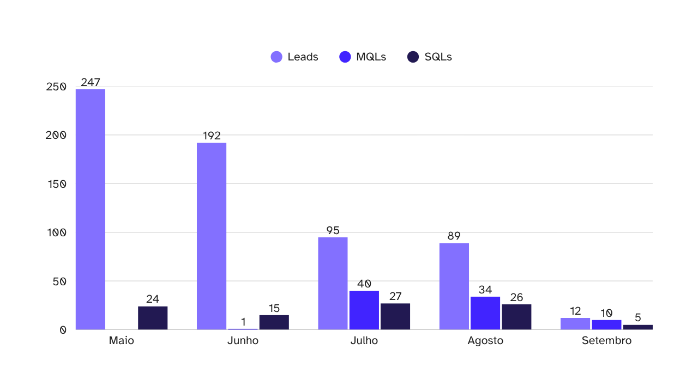
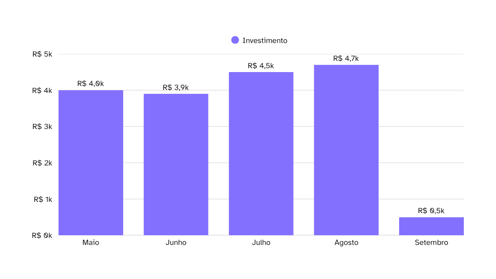
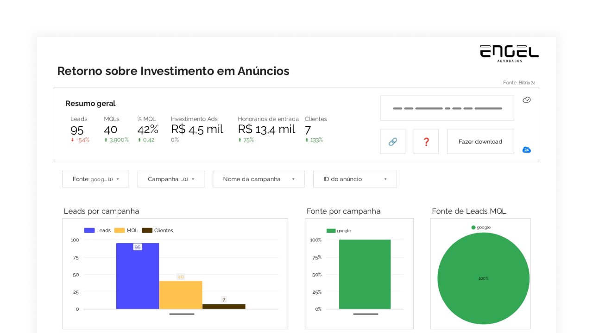

Introdução.

## O que é uma "conversão offline"?

As conversões offline são eventos importantes que ocorrem fora do meio onde a pessoa fez a conversão inicial (por assim dizer).

Por exemplo: se o seu Lead chegou no CRM através de um formulário em uma LP, essa conversão no formulário é o que está marcado como conversão no gerenciador de anúncios, certo?

Mas, depois do Lead cair no seu CRM, ele **ainda deve passar pelo processo de qualificação**, para então definir se vale seguir com ele ou não.

E é aqui que entra a conversão offline: com um processo de qualificação bem definido, é possível registrar um evento de conversão novo, como "Lead qualificado", e usar ele para guiar as suas campanhas.

Dessa forma, você passa a otimizar os anúncios de acordo com o seu funil de vendas de forma automática! Saindo de um gestão onorosa de públicos e meios de veiculação e pode se concentrar apenas nos criativos.

> A Meta inclusive já comentou que [pretende eliminar as personalizações de público]() e afins do gerenciador de anúncios dela, com objetivo de que você apenas envie o criativo e a campanha cuide de todo resto.

E você não precira parar em "Lead qualificado", você pode enviar também conversões de "Compra" quando o Lead assina o contrato, e, por exemplo, [obter o ROAS das campanhas](/trabalhos/obtendo-o-roas-de-campanhas-publicitarias) diretamente no painel gerenciador de anúncios.

Todas essas informações adicionais ajudam a inteligência da campanha a identificar melhor quem é o seu "Lead qualificado" sem você precisar definir isso explicitamente nas configurações de público.

> Algumas configurações como Advantage+, do Meta, ou as campanhas de Performance MAX, do Google, só vão funcionar corretamente com esse nível de detalhe dos dados, caso contrário, vão queimar seu orçamento atirando para todos os lados em busca de "pessoas que preenchem formulários de contato".

## Qual papel do CRM na inteligência das campanhas?

O CRM possui um papel fundamental na inteligência das campanhas, mas somente se utilizado corretamente.

O que eu quero dizer é que, caso você não tenha um CRM bem padronizado, um processo de qualificação bem definido e um gestor de tráfego pago que entende como funciona o seu Comercial, provalmente você não colherá os benefícios das conversões offline.

## Quais os resultados para as campanhas de anúncios?

Para exemplificar melhor os benefícios da configuração das conversões offline no Google Ads, resolvi trazer um pouco do meu trabalho na Engel Advogados.

A Engel, que [já apresentei em outro artigo](/trabalhos/como-alcancei-um-roas-de-320-em-um-escritorio-de-advocacia), é um escritório de advocacia que atua principalmente com teses de nicho, ou seja, trabalham com uma fatia muito específica do mercado (com um problema jurídico muito específico mesmo).

E como você já deve imaginar, com uma fatia tão pequena do todo, grande parte do foco nos trabalhos era na definição do público e formas de veiculação dos anúncios: *"Onde deve aparecer?"*, *"Para quem deve aparecer?"* e *"Quando deve aparecer?"*.

Mas se você já trabalhou com Google Ads, sabe que ele não gosta de fatias muito pequenas do público, e isso se traduziu em um *Custo por Lead* (CPL) altíssimo para o escritório: cada Lead chegava a custar R$ 100 para esse nicho em específico.

No entanto, a Engel tinha **duas vantagens** que a antiga agência que cuidava dos anúncios não conseguiu explorar em todo seu potencial:
1. Um CRM muito bem configurado, e;
1. Um processo comercial claro e bem segmentado.

E com esses dois blocos de base, foi possível configurar as marcações de Leads qualificados no CRM da Engel e, posteriormente, configurar uma nova — e temida — campanha de Performance Max no Google Ads.

> Veja que, mesmo com a informação da qualificação disponível todo esse tempo, eles ainda não marcavam os Leads como qualificados no CRM, apenas se eram SQLs ou não.

Quanto as campanhas anteriores, elas foram encerradas, em prol da nova (e única) campanha, e todo o orçamento anterior foi redirecionado para essa iniciativa.

Em apenas dois meses, já foi possível ver os resultados:
* Entre Maio e Agosto, o número de Leads gerados diminuiu em ~64%;
* A proporção de Leads qualificados (MQLs) chegou a 42%, e;
* A proporção de SQLs disparou de ~10%, em Maio, para 30%, em Agosto, chegando a 41% no começo de Setembro (4x mais alta).

> Os dados de Setembro são de 01/09 a 04/09.

Com o sucesso preliminar da nova campanha, o orçamento foi gradualmente sendo elevado ao longo do tempo:

Agora, para os mais atentos: você deve pensar que o CPL aumentou nesse período, já que estamos investindo mais para receber menos Leads; e você está certo!

O CPL, que estava por volta de R$ 16 em Maio, chegou a bater os R$ 52 em Agosto.

Essa é uma das consequências de afunilar o público, que, nesse caso, foi uma ação executada automaticamente pela inteligência de campanha do Google, aprimorada pelos dados de conversão offline do CRM da Engel Advogados.

No entanto, quando comparamos o custo por SQL (que é um Lead efetivamente qualificado para venda), vemos que esse custo foi exatamente o mesmo (R$ 166,66) em Maio e em Julho, mesmo com Julho tendo apenas 2/5 dos Leads que Maio.

Isso significa que as oportunidades que chegam para o time Comercial estão mais quentes, ou seja: a implementação das conversões offline na campanha do Google Ads melhorou também a eficácia das campanhas, trazendo Leads mais ativos e dispostos a fechar contrato.

> A partir da melhoria nas campanhas, também é possível identificar onde estão os demais gargalos na sua operação. No caso da Engel, identificamos alguns processos comerciais que estavam atrapalhando as vendas, mas isso só foi possível, pois tínhamos os dados da qualidade dos Leads entregues ao time para atuação.

E, após toda implementação das melhorias na campanha do Google Ads, foi possível obter um retorno de 297% sobre o investimento feito na campanha, em outras palavras: para cada R$ 1 investido, R$ 2,97 retornavam para o escritório, em forma de honorários de entrada.

> Na Engel Advogados, apenas os Honorários de Entrada são contabilizados para o cálculo do ROAS das campanhas.

## Como eu configurei a API do Google Ads na Engel Advogados

Texto.