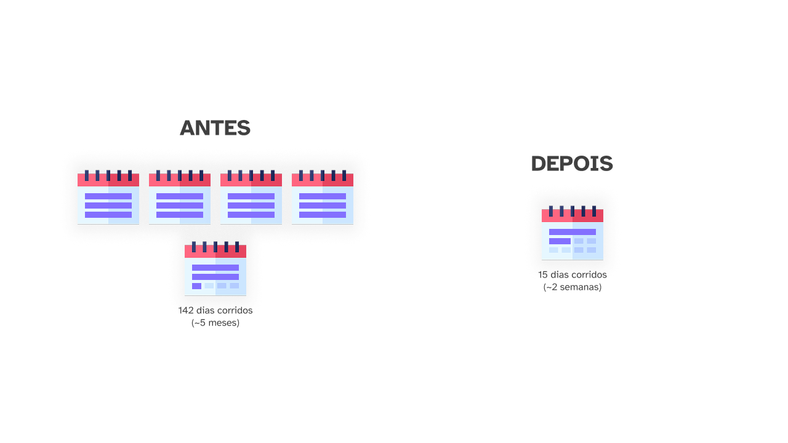

> Este projeto foi inscrito para o prêmio DNA+ da FENALAW 2025. O artigo apresenta alterações, em relação ao texto original, para fins didáticos.

No mundo do marketing digital, a eficiência é a chave para o sucesso.

Não adianta você ter um processo lindo e detalhado se ele não atende as suas necessidades.

Neste projeto, demonstro como a **Engel Advogados** superou o desafio de um processo de produção de conteúdo **100x mais lento que o planejado** e **10x mais caro do que o necessário**.

A solução?

Uma abordagem multifacetada que uniu **automação**, **inteligência artificial** e a reestruturação dos **fluxos de trabalho** do escritório.

O objetivo era claro: otimizar a produção de artigos para suportar a estratégia de SEO e ranqueamento e aproveitar melhor temas do momento.

Tudo isso para garantir um canal de aquisição de clientes robusto na mídia orgânica.

## Qual o impacto do tráfego orgânico na Engel Advogados?

Na Engel, o blog representa uma grande fatia de acessos ao site: de fato, dos mais de **130 mil acessos** que tivemos no escritório entre janeiro e julho de 2025, 50% do total são da **pesquisa orgânica do Google** (*acessos de graça*).

> Caso tivéssemos que pagar pelos pouco mais de 70 mil acessos da pesquisa orgânica do Google, esse seria um custo adicional de **R$ 64.500,00** com anúncios entre janeiro e julho (ou pouco mais de R$ 10 mil/mês).

Com isso, é evidente que a estratégia de manter relevância no meio orgânico gerou não só uma grande economia financeira para a empresa, como também uma gigantesca oportunidade para obtenção de leads a um baixo custo.

Essa grande parcela de acessos orgânicos também representa o **principal canal de obtenção de clientes** para o escritório.

Somente do 2° trimestre de 2025, 90% dos mais de 500 novos clientes tiveram como origem nossos canais orgânicos (seja o blog ou as redes sociais do escritório).

Na Engel, a base para produção de conteúdo consiste em **artigos para o blog**.

Mas o principal desafio enfrentado pelo escritório era a **demora** e o **custo** que todo o processo de produção de artigos apresentava: desde a ideia de um artigo até o produto final.

## Como era o processo de criação de conteúdo?

O processo de produção de contéudo na Engel era **extenso** e **bem ramificado**, fruto de anos de desenvolvimento e aprimoramento.

Como o escritório não contava com um agente de Marketing interno, o processo de produção de conteúdo consistia no trabalho conjunto entre a empresa e mais três prestadores de serviço:

> Essa é uma visão simplificada do fluxo de trabalho, que contava com impressionantes 16 etapas.

Com tudo, esse processo, **essencial para suportar o canal orgânico**, era gerenciado em uma única pipeline (de *SPAs* — *Smart Process Automation*) dentro do CRM da Engel.

Além da **falta da especialização** dos fluxos de trabalho, haviam também outros problemas que impactavam na eficiência da operação, como:
* **Ausência de um responsável central** para supervisão do trabalho;
* **Operadores não dedicados** (3 a 4) e sem especialização em Marketing na execução das tarefas;
* **Ausência de automações para o trabalho repetitivo** como criar tarefas, as pastas e arquivos no Google Drive e, posteriormente, sincronizar essas pastas e documentos, manualmente, em ambos os sistemas da Engel e os dos prestadores de serviço.

Como você já deve ter notado, **era um processo extremamente manual e maçante**, mas que permanecia rodando pelo alto impacto que gerava quanto a aquisição de clientes.

### Um processo há muito sem otimização

Para cada etapa do processo, também eram **estipulados prazos em SLA** (*service-level agreement*) pelos prestadores de serviço para conclusão das solicitações.

Isso, em teoria, deveria tornar o processo mais **previsível** e **consistente**.

No entanto, esse não era o cenário experienciado pelo escritório.

Pelos prazos fornecidos pelo prestador de serviço, de **3 dias úteis para produção do briefing** e **5 dias úteis para artigos e roteiros de vídeo**, o tempo médio entre a concepção de uma ideia e o produto final deveria variar de **13 a 16 dias úteis**.

Contudo, em consequência da forma como o fluxo de trabalho fora organizado, o tempo médio **real** experienciado era de impressionantes **142 dias corridos** (ou 101 dias úteis): quase **10x mais lento do que o previsto**.

Essa **demora entre uma ideia e o produto final** também afetava a capacidade do escritório em **abordar temas do momento**, já que, quando o artigo finalmente estivesse pronto, **as chances dele ainda ser relevante eram muito baixas**, pois o *boom* de interesse já havia passado.

> Isso se tornou uma dor ainda mais latente em situações como as dos descontos indevidos do INSS por associações, pois, mesmo se o escritório quisesse se posicionar, o primeiro artigo só sairia em 5 meses (e, como sabemos, o Governo já haveria se pronunciado sobre o assunto).

Além disso, os custos dessa operação eram significativos para a balança financeira da Engel, já que, somente o prestador de serviço para produção textual custava em torno de **R$ 72 mil/ano** (ou R$ 6 mil/mês).

## Quais foram as estratégias implementadas para abordar o problema?

A solução proposta para **otimizar o tempo de produção de conteúdo** e **economizar em custos operacionais** foi uma abordagem multifacetada que consiste em **internalizar**, **diagnosticar** e **otimizar**.

Começando pela **internalização**, com a contratação de um [especialista de Marketing](/) para atuar especificamente na resolução deste problema.

A partir desse momento, foi possível construir uma estrutura interna que permitisse **diagnosticar o problema**, **ponderar soluções** e **implementar** as ações necessárias para otimizar o fluxo de trabalho.

Foi nesta etapa inicial de dianóstico do problema, que identificamos os pontos de atrito críticos dentro do fluxo de trabalho que mencionamos anteriormente, nominalmente:
1. **Falta de um responsável** pelo processo;
1. **Operadores não especializados** nas atividades as quais eram atribuídos;
1. **Pipeline única** cuidava de atividades de diferentes especialidades;
1. **Excesso de atividades manuais** no sistema da Engel, e;
1. **Retrabalho constante** para sincronizar os sistemas do escritório com os do prestador de serviço;

E, para eliminar esses atritos e otimizar o processo de criação de conteúdo no escritório, foram implementadas as seguintes ações, estruturadas em três pilares:

### Especialização dos fluxos de trabalho

Como primeira ação, foi realizado **o mapeamento e particionamento** da antiga pipeline monolítica para trabalho com produção de conteúdo.

A partir desse mapeamento, concluímos que era necessário dividirmos a pipeline em dois fluxos especializados:

* Um dedicado à **produção de artigos**, abrangendo pesquisa, redação, revisão e publicação;
* E outro voltado à **produção de vídeos**, incluindo concepção do roteiro, gravação, edição e distribuição.

Com essa abordagem, foi possível **criar POPs** (procedimentos operacionais padrão) e consolidar atividades em cada pipeline, permitindo a **criação de tarefas mais específicas** para o êxito na produção de cada conteúdo, agilizando o processo.

Veja como ficou a nova pipeline para produção de artigos do blog, mais ágil, mais simples e mais objetiva:

> Das 16 etapas, a pipeline de produção de artigos (o foco deste case) agora contava com apenas 6, com a pipeline de produção de vídeos somando 7 etapas. 

Essa abordagem permitiu não somente a melhor **audotoria de eficiência** — com a análise individual de cada processo de produção — como também **facilitou a inserção de novos operadores no processo** — mesmo que não especializados — agora que cada etapa possuia tarefas mais objetivas e detalhadas.

### Automação e sincronização entre sistemas

Outra grande peça na estratégia de otimização da produção de conteúdo foi a **automação de tarefas repetividas**.

Com os novos fluxos de trabalho devidamente padronizados e documentados, contratamos uma **plataforma no-code** (*Make.com*) para auxiliar com as automações e interações entre sistemas.

E, a partir daí, foi possível criar automações específicas para **eliminação das atividades manuais repetitivas**, como a criação de pastas e documentos ou a sincronização entre os sistemas da Engel e seus prestadores — uma atividade que não só demandava muito tempo, como também era muito propensa a erros.

![Diagrama apresentando as etapas e automações na pipeline de produção de artigos. No processo de Ideia, há uma tarefa de Tarefa de planejamento. Na etapa de Briefing, as tarefas são: Cria pasta no Drive, Libera acesso para o prestador, Atualiza sistema da Engel, Atualiza sistema do prestador e Aguarda entrega do prestador. A etapa de Aprovação tem a tarefa Tarefa para operador. Na etapa de Artigo, as tarefas são: Atualiza sistema do prestador e Aguarda entrega do prestador. A etapa seguinte de Aprovação tem a tarefa Tarefa para operador. Por fim, a etapa de Publicar tem a tarefa Tarefa para operador.](../../assets/photos/reduzindo-em-100x-o-custo-de-producao-de-conteudo-com-ia-foto-4.png)

> Para se ter uma ideia, antes, quando uma entrega de Briefing ou Artigo era realizada, a Engel era comunicada via e-mail e, após isso, era necessário que o operador visse a mensagem para que, então, procurasse o respectivo card no sistema da Engel e alterasse a etapa manualmente.

Assim, foi possível [reduzir horas de trabalho com tarefas de baixo valor agregado](/trabalhos/automacao-de-trabalho-operacional-repetitivo), **aumentando a produtividade dos operadores** e reduzindo os pontos de estresse com o trabalho sendo executado (por conta da eliminação das atividades morosas).

Dessa forma, o operador nem precisava sair do sistema da Engel para conferir o andamento das atividades, o que auxiliou a manter todo fluxo de trabalho em uma única plataforma.

### Implementação da Inteligência Artificial

Por fim, a estratégia também incluia a **implementação de inteligência artificial** (IA) como um meio para conseguir um salto de agilidade ao processo.

A proposta era utilizar a IA para auxiliar em atividades repetitivas que **poderiam ser realizadas de maneira programática**.

Durante a criação dos fluxos de trabalho especializados, identificamos oportunidades de **inserir LLMs generativas como operadores no fluxo**.

> Testamos diversas IAs, como as famílias *DeepSeek V3 e R1*, *GPT-4o*, *GPT-4.5* e a família do *Gemini 2.5* (à época, em pré-visualização). Acabamos por escolher os modelos *2.5 Flash* e *2.5 Pro*, do *Gemini*, pela capacidade de [seguir os prompts consistentemente](/portfolio/estrutura-de-prompt-para-ia).

Com a oportunidade ideal localizada e um objetivo claro, seguimos com a implementação gradual da IA para a criação dos **documentos de briefing**, tanto para os artigos de blog quanto para os roteiros de vídeos para o YouTube.

> Os documento de briefing são o início de todo processo criativo, e, por isso, a utilização da IA deve ser cuidadosa: dá-se muito espaço e a IA alucina, restringe a liberdade e ela não entrega — é uma linha tênue.

E, após validação do funcionamento, extendemos o alcance da IA para **também produzir os textos do blog por completo**, seguindo essa mesma premissa de implementação gradual.

Ao final da implementação da IA, obtivemos um fluxo de trabalho semelhante ao exemplificado abaixo:

![Fluxograma apresentando funcionamento final da pipeline de produção de artigos. No processo de Ideia, há uma tarefa de Tarefa de planejamento. Na etapa de Briefing, as tarefas são: Cria pasta, Obtém sitemap, planeje, e Instruções, IA produz briefing, Cria documento na pasta e Tarefa para operador. Na etapa de Aprovação, a única tarefa é Tarefa para operador. Na etapa de Artigo, as tarefas são: Procura pasta no Drive, IA produz artigo, Cria documento na pasta e Tarefa para operador. A etapa seguinte de Aprovação tem a tarefa Tarefa para operador. Por fim, a etapa de Publicar tem a tarefa Tarefa para operador.](../../assets/photos/reduzindo-em-100x-o-custo-de-producao-de-conteudo-com-ia-foto-5.png)

Com isso, a IA atua como operador e faz grande parte do processo, com isso, o número de pessoas supervisionando o processo poderia ser reduzido e as pessoas responsáveis precisavam apenas fornecer o direcionamento inicial e, então, conferir as entregas da LLM.

## Quais foram os resultados alcançados?

Com a implementação de todas as estratégias, conseguimos resolver os desafios de **custo** e **demora** que antes travavam a produção de conteúdo, o principal canal de aquisição de clientes do escritório.

### Gigantesca diminuição nos custos operacionais

E o resultado mais impactante foi a **diminuição nos custos operacionais**:
* A **internalização**, **reestruturação** e **automação** do processo permitiram o encerramento do contrato com o prestador de serviços de produção textual, que, sozinho, representava um custo anual de aproximadamente **R$ 72 mil**.

Este valor foi substituído por despesas operacionais mínimas, incluindo uma média de **R$ 60/mês** com a plataforma no-code de automação contratada (*Make.com*) e apenas **R$ 0,36/mês** com o provedor de IA (*Gemini*).

O sucesos na implementação resultou em uma redução de custos anual de mais de **100x** (ou, apenas **R$ 720/ano** em despesas operacionais), atingindo em cheio o objetivo inicial de "otimizar e economizar gastos com prestadores de serviços".

Com isso, conseguimos alcançar uma economia anual estimada (sistema + mão de obra) de mais de R$ 72 mil, com uma **economia em 5 anos de aproximadamente R$ 360 mil com a produção de conteúdo**.

Isso, para escritórios de médio porte, que faturam até **R$ 1 milhão por ano**, representa uma **economia de 7,2% do faturamento anual**, que podem ser reinvestidos em outras áreas do escritório, como os [anúncios](como-alcancei-um-roas-de-1065-em-um-escritorio-de-advocacia).

> E, para escritórios menores, essa economia pode ser ainda mais representativa do faturamento total.

Além dos ganhos de tempo e dinheiro, houve um **impacto significativo no capital humanos**:
* A automação de tarefas repetitivas, como a gestão de cards e tarefas no CRM e a criação de pastas e arquivos, aliviou a carga de trabalho da equipe interna.

Essas automações [diminuíram a quantidade de horas humanas alocadas em atividades de baixo valor](automacao-de-trabalho-operacional-repetitivo) e permitiram que os colaboradores se concentrassem em **tarefas mais estratégicas**, como a pesquisa de conteúdo e palavras-chave.

### Drástica redução no tempo de produção

A segunda grande vitória foi a **redução no tempo de produção**:

O **tempo médio** entre a concepção de uma ideia e a entrega do produto final (artigo/roteiro de vídeo), que antes era de **142 dias corridos**, foi reduzido para **apenas 15 dias**!

> Essa otimização representa um aumento de quase **10x** na eficiência da produção.

Essa melhoria foi alcançada em etapas:

1. A **reestruturação do fluxo de trabalho reduziu** o tempo inicial de 142 dias corridos para 52 dias (3x mais eficiente);
1. E a posterior **implementação da IA**, para gerar documentos como briefings, artigos e roteiros, diminuiu o tempo para a média final de 15 a 17 dias corridos (3x mais eficiente).

> Como os conteúdos divulgados pela são de cunho jurídico, todos os textos, tanto o briefing como artigos e roteiros, passam pelo crivo das advogadas do escritório — uma etapa que não foi alterada.

Ao eliminar erros manuais e atrasos, as novas pipelines também permitiram que **mais conteúdos fossem produzidos simultaneamente**, escalando a capacidade de entrega e fortalecendo o principal canal de aquisição de clientes do escritório por uma fração do custo anterior.

### Conclusão

Com todas essas inovações implementadas, o escritório não só conseguiu **internalizar a produção de conteúdo**, como também **aprimorou a qualidade** e **escalou significativamente sua capacidade de entrega**.

Esse ganho de eficiência, por consequência, **liberou horas de trabalho dos operadores** em atividades de baixo valor agregado, o que permitiu que o especialista contratado expandisse sua atuação para **outras frentes estratégicas do escritório** — aumentado o aproveitamento do capital humano do escritório — como:
  * **Tráfego pago**, com a implementação do projeto para [obtenção do ROAS](/trabalhos/obtendo-o-roas-de-campanhas-publicitarias) das campanhas que rodavam no escritório;
  * **Automações no CRM**, com a criação de um *custom app* no *Make.com* para [utilização especializada da API de SPAs do Bitrix24](/portfolio/bitrix24-api-assistant-app-make-com) (para automações ainda mais especializadas), e;
  * **Análise de dados**, com desenvolvimento de relatórios e sistemas (como o [traqueamento de leads via UTM](/portfolio/traqueamento-de-leads-a-partir-de-utms)) para as dinâmicas de planejamento interno da empresa.

Isso demonstra o impacto positivo do projeto na **produtividade geral da equipe interna**, que agora pode se dedicar a **tarefas estratégicas** e iniciativas que **geram mais valor para o escritório**.